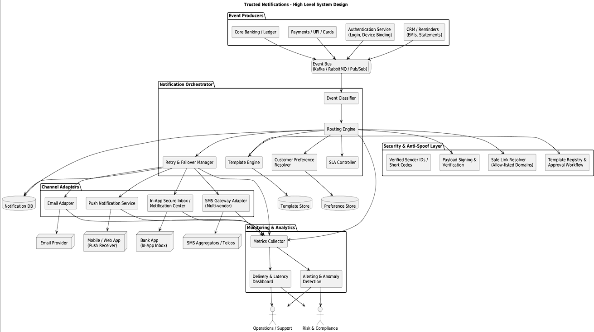

# Trusted Notifications Orchestrator

A full‑stack demo of a **Trusted Notification Orchestrator** that provides reliable, safe and timely delivery of:
- OTP
- High‑value debit alerts
- Card‑not‑present alerts
- Service reminders

It implements a **unified event router**, multi‑channel delivery (SMS / Email / Push / In‑App), basic **failover**, **idempotency**, and **user notification preferences**, plus a small React dashboard for monitoring.

---

## 1. Tech Stack

### Backend
- Node.js + Express
- MongoDB Atlas (via Mongoose)
- Simple HMAC‑based payload signing stub

### Frontend
- React 18 + Vite
- Fetch API to talk to backend

---

## 2. High‑Level Architecture

`Producers (core banking, apps) → Unified Event API → Orchestrator → Channel Adapters → External Vendors / In‑App`



Main responsibilities:

1. **Unified Event Router**
   - Single endpoint: `POST /api/events`
   - Accepts: `eventType`, `userId`, `payload`, `messageId`
   - Uses a routing matrix to choose channels based on event type (OTP, HIGH_VALUE_DEBIT, etc.)

2. **Orchestrator & Routing Matrix**
   - Central logic in `backend/orchestrator/router.js`
   - Routing examples:
     - OTP → SMS → Push → Email
     - HIGH_VALUE_DEBIT → Push → SMS → Email
     - CARD_NOT_PRESENT → Push → SMS
     - SERVICE_REMINDER → Push → In‑App
   - Respects **user preferences** before attempting a channel.

3. **Channel Adapters**
   - SMS: `orchestrator/channels/smsChannel.js`
   - Email: `orchestrator/channels/emailChannel.js`
   - Push: `orchestrator/channels/pushChannel.js`
   - In‑App: `orchestrator/channels/inAppChannel.js`
   - Currently use simulated sends (random failure) to demonstrate **failover and retries**.

4. **Data Model (MongoDB)**
   - `NotificationEvent`: High‑level event (OTP / transaction alert)
   - `Notification`: Individual channel attempts (SMS/Email/etc.)
   - `UserPreference`: Per‑user channel ON/OFF
   - `Template`: Approved message templates to prevent spoofing
   - `Vendor`: Configurable SMS/Email vendors with priority and health flags

5. **Reliability Features**
   - **Idempotency**: `messageId` is stored in `NotificationEvent` so duplicate API calls with same ID are ignored.
   - **Vendor Failover**: For SMS, the orchestrator loops through configured vendors in priority order.
   - **Stats API**: `/api/stats` exposes total events, sent, failed and success rate.

---

## 3. How to Run Locally

### 3.1 Backend

1. Go to the backend folder:

   ```bash
   cd backend
   ```

2. Install dependencies:

   ```bash
   npm install
   ```

3. Create `.env` from `.env.example` and set your MongoDB connection string:

   ```env
   MONGO_URI=mongodb+srv://<user>:<password>@<cluster>/<dbName>?retryWrites=true&w=majority
   PORT=5000
   SIGNING_SECRET=demo-secret-key
   ```

4. Start the backend:

   ```bash
   npm run dev
   ```

   You should see:

   ```
   ✅ MongoDB connected
   🚀 Backend server running on port 5000
   ```

### 3.2 Frontend

1. Open a second terminal and go to the frontend folder:

   ```bash
   cd frontend
   ```

2. Install dependencies:

   ```bash
   npm install
   ```

3. (Optional) Create a `.env` file with API base:

   ```env
   VITE_API_BASE=http://localhost:5000
   ```

4. Run the dev server:

   ```bash
   npm run dev
   ```

5. Open the printed URL (usually `http://localhost:5173`).

---

## 4. Frontend Screens

The React UI includes four main sections:

1. **Header**
   - Project title and description
   - Current `userId` field (bound to preferences and events)

2. **Monitoring Dashboard (`Dashboard.jsx`)**
   - Uses `/api/stats` to display:
     - Total events
     - Total notifications
     - Sent
     - Failed
     - Success rate (%)

3. **Trigger Test Event (`TriggerEventForm.jsx`)**
   - Allows selecting event type:
     - OTP
     - HIGH_VALUE_DEBIT
     - CARD_NOT_PRESENT
     - SERVICE_REMINDER
   - For OTP, you can enter an OTP code.
   - On submit, it calls `POST /api/events` and shows the JSON response.

4. **User Notification Preferences (`PreferencesForm.jsx`)**
   - Shows the current user's channel flags (SMS/EMAIL/PUSH/IN_APP).
   - Uses `/api/preferences/:userId` GET + POST.
   - Turning channels off and on lets you demo how routing respects user choice.

5. **Notification Log (`NotificationTable.jsx`)**
   - Shows the last 100 notifications.
   - Columns:
     - Event type
     - User
     - Channel
     - Status
     - Vendor
     - Attempt count
     - Created time
   - Auto-refreshes every 5 seconds to simulate live monitoring.

---

## 5. API Overview

### 5.1 `POST /api/events`

**Purpose:** Unified event ingestion endpoint.

**Body example (OTP):**

```json
{
  "eventType": "OTP",
  "userId": "user-123",
  "messageId": "OTP-1722341234567",
  "payload": {
    "otp": "123456",
    "phone": "+911234567890",
    "email": "user@example.com"
  }
}
```

**Responses:**
- `202 Accepted` – event stored, orchestrator starts async processing.
- `200 OK` – duplicate event ignored (idempotent).
- `400` – missing fields.
- `500` – server error.

### 5.2 `GET /api/notifications`

Returns recent notification attempts with populated event info.

### 5.3 `GET /api/stats`

Returns:

```json
{
  "totalEvents": 10,
  "totalNotifications": 25,
  "sent": 20,
  "failed": 5,
  "successRate": "80.00"
}
```

### 5.4 `GET /api/preferences/:userId`

Returns a `UserPreference` document for the given user, creating a default one in memory if not found.

### 5.5 `POST /api/preferences/:userId`

Body:

```json
{
  "channels": {
    "sms": true,
    "email": true,
    "push": true,
    "inApp": true
  }
}
```

Updates the saved preferences for that user.

---

## 6. How to Explain in Viva / Submission

1. **Problem Statement**
   - Banks & fintechs need reliable, safe, and timely notifications for security‑critical events.
   - Existing systems may send duplicate OTPs, fail silently, or lack failover between vendors.

2. **Proposed Solution**
   - A centralized orchestrator layer that:
     - Accepts events through a unified API.
     - Uses an intelligent routing matrix per event type.
     - Respects user channel preferences.
     - Performs vendor failover and calculates success metrics.

3. **Key Design Choices**
   - **Node.js + Express**: lightweight REST API, fast to prototype.
   - **MongoDB**: schema‑flexible documents for events & notifications.
   - **React Dashboard**: easy demo with live stats and logs.
   - **Idempotent API**: prevents duplicate notifications when upstream retries.

4. **Extensions / Future Work**
   - Replace simulated SMS/Email with real providers (Twilio, SendGrid, etc.).
   - Add a proper in‑app inbox collection and UI.
   - Introduce rate limiting, tracing and audit logs.
   - Convert to microservices with message queues (Kafka/RabbitMQ) for large scale.

---

## 7. GitHub Usage (Submission Branch)

Suggested commands to push this project to GitHub on a `submission` branch:

```bash
# inside the project root (where this README is)
git init
git add .
git commit -m "Trusted Notifications Orchestrator - submission version"

# Add your remote (replace URL with your actual GitHub repo)
git remote add origin https://github.com/<your-username>/<your-repo>.git

# Create and push the submission branch
git checkout -b submission
git push -u origin submission
```

You can then share the GitHub repository link (with `submission` branch) as your final project submission.
